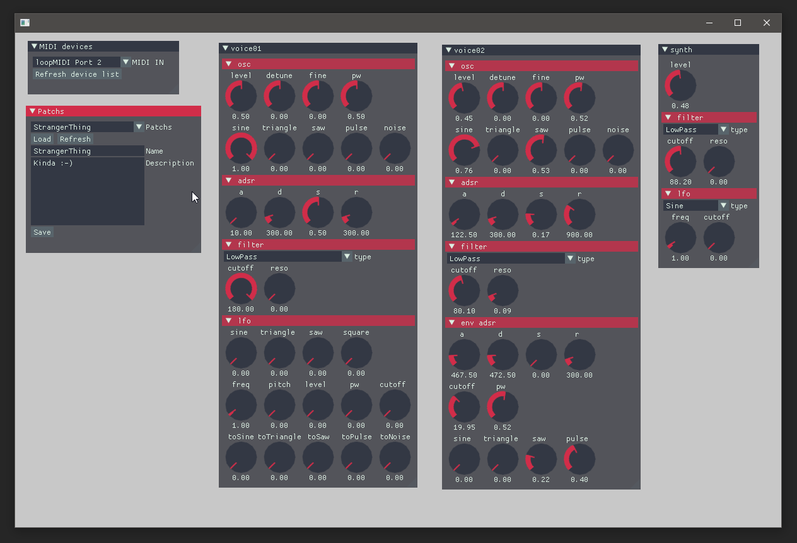

# WIP ofxPDSPTools

**`Work in progress`**    

High level modules and tools to use with [ofxPDSP](https://github.com/npisanti/ofxPDSP). Like Synth, Synth parameters, patch saving/loading, UI helpers ... 

Not sure of everything yet, code can change at any moment.

Project started to learn DSP, get back into shape with C++ and explore OF.

## Dependencies & Thank's

Thanks to [OpenFrameworks](https://openframeworks.cc/), [npisanti](https://github.com/npisanti), [ocornut](https://github.com/ocornut), [jvcleave](https://github.com/jvcleave) for there super works.

This addon relies on other libraries :

- [ofxPDSP](https://github.com/npisanti/ofxPDSP)
   - ofxOsc
   - [ofxMidi]()
   - [ofxAudioFile]()
- [ImGui (fork)](https://github.com/MacFurax/imgui)
- [ofxImGui (fork)](https://github.com/MacFurax/ofxImGui)
- ofxXmlSettings

## Install
Clone the project in OF\addons

### Compile

I can only test on Windows with Visual Studio 2017/2019.
But should compile on other platform as I don't use only OF addons.

If the project is cloned in OF\addons everything should be ok.

## Modules

### Patch
#### PatchParams

This class allow to build a hierachy of ParamDesc which contain an pdsp::Parameter which encapulsate an ofParameter.
It also maintain a ofParameterGroup to ease (de)serialization using ofxXmlSettings.

For each ParamDesc you can provide layout options that will be used by the UI part to draw controls.

#### PatchFilesStore

Use the ofParameterGroup of PatchParams to help store/load synth patchs from a given folder.

### Synth

Still bit messy.

### UI

All UI is based on a fork of ofxImGui & ImGui.

PatchParam being an abstraction, it could be used to draw UI with ofxGui.

UI helpers to :
- draw PatchParams controls to setup synth
- provide a UI to select MIDI output
- provide a UI to save/load patches

# Examples
## example_midi_substractive_synth

This was inspired by the book `Creating Sounds from Scratch` from `Andrea Pejrolo` & `Scott B. Metcalfe`, Arturia Minibrute 2 controls layout and other .

This example feature a synth with a two OSCs voice.

Both allow to select:
- wave forms weight
- detune (coarse and fine) 
- ADSR envelop shape
- filter (filter type, cutoff and reso)

One provide ADRS to control the filter.

The other provide an LFO ton control many parameter of the voice.

 

# To Do

Select a licence.

Not clear yet, but the idea is to create a track object to which I could bind a synth and FXs.
All build using ofxPDS sequencer system.

